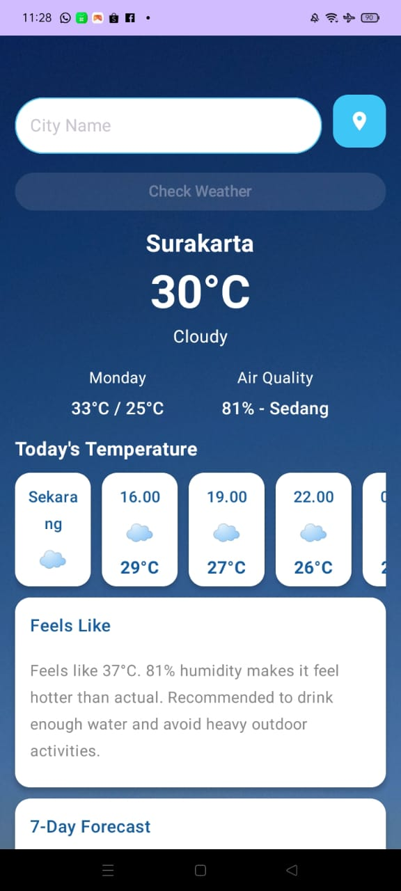
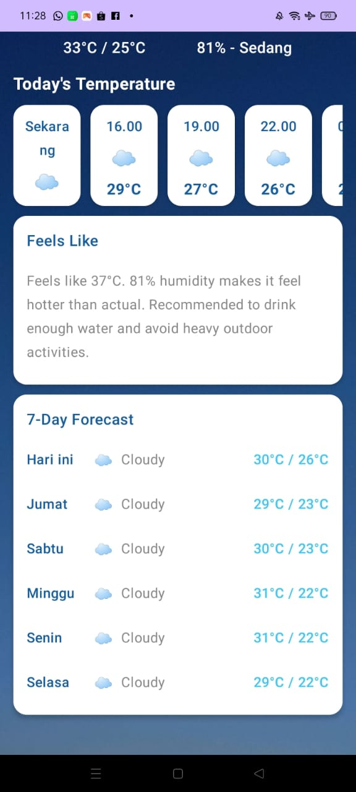

## Tentang Aplikasi

🌤️ Aplikasi Cuaca — Cek Cuaca dengan Tampilan Modern & Akurat
Aplikasi Cuaca ini dibuat untuk memberikan informasi cuaca secara real-time dengan tampilan yang modern, ringan, dan mudah digunakan. 
Mulai dari suhu saat ini hingga prakiraan cuaca per jam dan harian, semua bisa diakses hanya dalam sekali lihat.

✨ Fitur Utama
🌦️ 1. Cuaca Real-Time
Menampilkan suhu dan kondisi cuaca saat ini sesuai dengan lokasi pengguna.
Lihat perubahan cuaca setiap jam, lengkap dengan suhu dan kondisi langit.

  

📅 2. Prakiraan Cuaca Harian
Menunjukkan cuaca untuk beberapa hari ke depan, cocok untuk merencanakan aktivitas.

  

3. Bisa Landscape
   

  

